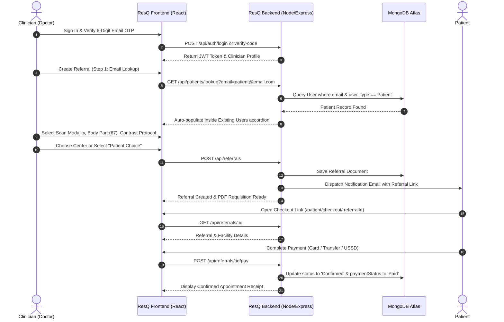

# ResQ Healthcare — Clinician Referral & Diagnostic Imaging Platform

<p align="center">
  
</p>

<p align="center">
  <strong>Africa's premier digital health network connecting clinicians, diagnostic facilities, and patients for streamlined medical requisitions and expedited imaging access.</strong>
</p>

<p align="center">
  
  
  
  
  
  
  
</p>

---

## 📑 Table of Contents
1. [Platform Overview](#-platform-overview)
2. [Key Capabilities & Features](#-key-capabilities--features)
3. [Architecture & Clinical Workflow](#-architecture--clinical-workflow)
4. [Technology Stack](#-technology-stack)
5. [Database Architecture & Data Models](#-database-architecture--data-models)
6. [REST API Endpoints](#-rest-api-endpoints)
7. [Directory Structure](#-directory-structure)
8. [Environment Configuration](#-environment-configuration)
9. [Getting Started (Local Development)](#-getting-started-local-development)
10. [Brand Identity & SEO Optimization](#-brand-identity--seo-optimization)
11. [Security & Role Enforcement](#-security--role-enforcement)

---

## 🏥 Platform Overview

**ResQ Healthcare** solves the fragmented diagnostic referral pipeline across Africa. The platform enables medical practitioners (doctors, consultants, and clinicians) to generate structured diagnostic requisitions, match patients with accredited diagnostic imaging centers (CT, MRI, Ultrasound, Mammography, X-Ray), automatically notify patients via email, and facilitate instant online appointment booking and payment.

---

## ✨ Key Capabilities & Features

### 1. Dedicated Clinician Portal
- **Strict Role Isolation**: Exclusively accessible to registered clinicians (`user_type === 'Clinician'`). Unauthorized roles (e.g. `Patient`) are barred with 403 Forbidden guards.
- **Two-Factor 6-Digit Email Verification**: Multi-factor authentication via Nodemailer SMTP with 10-minute expiring OTP codes.
- **Google OAuth Integration**: Single sign-on with automatic practitioner credential verification.

### 2. Overview Dashboard & Profile Management
- **Practitioner Profile Card**: Instant visibility of clinician credentials directly on the Overview tab:
  - Doctor Name & Avatar
  - `✓ ResQ Verified Clinician` Badge
  - Specialty & Medical Registration (MDCN)
  - Practice / Clinic Name & Address
- **Interactive Profile Editing**: Clinicians can update their clinical details, title, and practice location.
- **Immutable Email Protection**: In adherence to medical compliance and account integrity, the clinician's registered email address is **strictly locked and read-only**.

### 3. Isolated Multi-Step Referral Creation
- **Step 1: Patient Information (Existing Users vs. New User)**:
  - **Live Database Search**: Typing a patient's email queries MongoDB (`resqapp.users`) in real-time.
  - **Clean Workflow Separation**: Auto-populated patient profile details render **strictly within the Existing Users accordion** with a verified badge. The **New User** section remains clean, collapsed, and dedicated solely to registering unrecorded patients.
- **Step 2: Scan Details & Clinical Catalog**:
  - **8 Non-Duplicated Modalities**: CT Scan, MRI Scan, Ultrasound, X-Ray, Mammography, Fluoroscopy, Nuclear Medicine, PET/CT.
  - **67 Anatomical Body Parts**: Comprehensive anatomical catalog with a high-speed searchable combobox filter.
  - **Contrast Protocols**: Doctor-specified contrast protocol (`Without Contrast`, `Not Specified`, `With Contrast (IV)`, `With & Without Contrast`).
  - **Clinical Indication / Notes**: Detailed text notes and file attachment support for past laboratory reports.
- **Step 3: Scan Location**:
  - **Provider Selection**: Direct facility selection via the ResQ Facility Marketplace.
  - **Patient Choice**: Generates a secure referral link dispatched directly to the patient's email.

### 4. Facility Marketplace & Time-Slot Booking
- Live marketplace showcasing accredited diagnostic centers (e.g., *Phoebe Diagnostic Center*, *Lily Hospitals*, *Mecure Healthcare*).
- Filtering by proximity, rating, and transparent test pricing.
- Interactive calendar date and morning/afternoon time-slot reservation.

### 5. Automated Patient Notification & Payment Checkout
- Upon referral submission, an automated HTML email is dispatched to the patient containing the requisition summary and direct checkout link:
  `http://localhost:5173/patient/checkout/:referralId`
- Dedicated Patient Booking & Payment screen with multiple payment gateways (Credit/Debit Card, Direct Bank Transfer, USSD).
- Real-time confirmation marking the referral status as `Confirmed` and payment status as `Paid`.

---

## 🔄 Architecture & Clinical Workflow



---

## 💻 Technology Stack

### Frontend
- **Framework**: React 19 + TypeScript
- **Bundler & Dev Server**: Vite 8.3
- **Styling**: Vanilla CSS Design System with curated medical tokens, glassmorphic cards, and responsive grids.
- **Icons**: Lucide React
- **Date & Routing**: Native HTML5 History API & Custom Component Navigation

### Backend
- **Runtime**: Node.js (ES Modules)
- **Framework**: Express.js
- **Database**: MongoDB Atlas via Mongoose ODM
- **Authentication**: Custom JWT (`jsonwebtoken`) & Firebase Admin SDK
- **Email Delivery**: Nodemailer via Google Workspace SMTP
- **Caching & OTP Store**: Upstash Redis Cloud with in-memory fallback

---

## 🗄️ Database Architecture & Data Models

The MongoDB database (`resqapp`) models all platform entities:

### 1. `User` Collection
Stores Clinicians, Diagnostic Providers, and Patients:
```javascript
{
  id: String,                  // Unique user identifier
  user_type: String,           // 'Clinician' | 'DiagnosticProvider' | 'Patient'
  email: String,               // Unique, lowercase, indexed (IMMUTABLE)
  password: String,            // Hashed credentials
  fullname: String,            // Doctor or Patient full name
  phoneNumber: String,         // Contact line
  licenseNumber: String,       // MDCN Registration for clinicians
  specialty: String,           // Medical designation
  practiceName: String,        // Clinic / Hospital name
  practiceAddress: String,     // Clinical location
  isVerified: Boolean,         // Email OTP verification flag
  authProvider: String         // 'local' | 'google'
}
```

### 2. `Referral` Collection
Stores diagnostic imaging requisitions:
```javascript
{
  referralId: String,          // Human-readable code (e.g. 'REF-839201')
  doctorEmail: String,         // Referring clinician email
  doctorName: String,          // Referring clinician name
  doctorSpecialty: String,     // Clinician specialty
  doctorPractice: String,      // Referring medical center
  patientName: String,         // Full name of referred patient
  patientEmail: String,        // Patient email (receives booking notification)
  patientPhone: String,        // Patient phone
  patientGender: String,       // 'Male' | 'Female'
  patientDob: String,          // YYYY-MM-DD
  patientAddress: String,      // Residential address
  scanType: String,            // e.g. 'MRI Scan (Magnetic Resonance Imaging)'
  bodyPart: String,            // e.g. 'Brain', 'Lumbar Spine' (from 67 targets)
  contrastOption: String,      // 'Without Contrast' | 'With Contrast (IV)' ...
  clinicalNote: String,        // Clinical indication / findings
  priority: String,            // 'Normal' | 'Urgent'
  facilityId: String,          // Selected imaging facility ID
  facilityName: String,        // Facility brand name
  facilityAddress: String,     // Physical facility address
  facilityPrice: Number,       // Procedure cost in NGN
  slot: {
    date: String,              // e.g. 'Thu 20 February'
    time: String,              // e.g. '10:10 am'
    display: String
  },
  status: String,              // 'Submitted' | 'Confirmed' | 'Completed'
  paymentStatus: String,       // 'Pending' | 'Paid'
  referralLink: String         // Patient direct checkout URL
}
```

### 3. `ScanType` Collection
Stores the 8 standard imaging modalities (seeded on startup).

### 4. `BodyPart` Collection
Stores the 67 anatomical targets ordered and indexed for combobox filtering (seeded on startup).

---

## 📡 REST API Endpoints

A comprehensive guide to all REST endpoints exposed by the ResQ Healthcare API server.

---

### Quick Reference Table

| Category | Method | Endpoint | Access | Status Codes | Description |
| :--- | :--- | :--- | :--- | :--- | :--- |
| **System** | `GET` | `/api/health` | Public | `200` | System uptime & environment check |
| **Auth** | `POST` | `/api/auth/register` | Public | `200`, `400`, `500` | Clinician sign-up & 6-digit OTP dispatch |
| **Auth** | `POST` | `/api/auth/verify-code` | Public | `200`, `400`, `403`, `500` | Validate 6-digit OTP & return JWT |
| **Auth** | `POST` | `/api/auth/resend-code` | Public | `200`, `400`, `500` | Re-issue 6-digit verification code |
| **Auth** | `POST` | `/api/auth/login` | Public | `200`, `400`, `401`, `403`, `500` | Clinician password authentication |
| **Auth** | `POST` | `/api/auth/google` | Public | `200`, `400`, `403`, `500` | Google OAuth profile sync & login |
| **Auth** | `GET` | `/api/auth/me` | Bearer Token | `200`, `401`, `403`, `500` | Get current authenticated clinician |
| **Auth** | `PUT` | `/api/auth/profile` | Bearer Token | `200`, `401`, `403`, `404`, `500` | Update profile (**email strictly locked**) |
| **Catalog** | `GET` | `/api/clinical/catalog` | Public | `200`, `500` | 8 scan types, 67 body parts, contrast options |
| **Catalog** | `POST` | `/api/clinical/seed` | Bearer Token | `200`, `401`, `500` | Seed or re-seed clinical catalog in MongoDB |
| **Patients** | `GET` | `/api/patients/lookup` | Bearer Token | `200`, `400`, `401`, `500` | Live patient search by email |
| **Patients** | `GET` | `/api/patients` | Bearer Token | `200`, `401`, `500` | Directory of registered patient profiles |
| **Referrals** | `POST` | `/api/referrals` | Bearer Token | `201`, `400`, `401`, `500` | Create referral & email patient booking link |
| **Referrals** | `GET` | `/api/referrals` | Bearer Token | `200`, `401`, `500` | List referrals (filter by `doctorEmail`) |
| **Referrals** | `GET` | `/api/referrals/:id` | Public (Patient Link) | `200`, `404`, `500` | Get single referral details by ID |
| **Referrals** | `POST` | `/api/referrals/:id/pay` | Public (Patient Link) | `200`, `400`, `404`, `500` | Complete payment & confirm appointment |

---

### 1. System Health Check

#### `GET /api/health`
Checks server responsiveness, environment configuration, and database connection.

- **Access**: Public
- **Headers**: None

**Status Codes**:
- `200 OK`: Server is online and functioning normally.

**Request Body**: None

**Success Response (`200 OK`)**:
```json
{
  "status": "online",
  "service": "ResQ Healthcare Authentication & Clinical Server",
  "environment": "development",
  "timestamp": "2026-09-12T21:57:08.339Z"
}
```

---

### 2. Authentication & Clinician Management

#### `POST /api/auth/register`
Registers a new medical practitioner and sends a 6-digit OTP verification code to their email.

- **Access**: Public
- **Headers**: `Content-Type: application/json`

**Status Codes**:
- `200 OK`: Registration successful; OTP email dispatched.
- `400 Bad Request`: Missing email or password, or email already registered.
- `500 Internal Server Error`: Mail server failure or database write error.

**Request Body**:
```json
{
  "email": "doctor@hospital.org",
  "password": "SecurePassword123",
  "fullname": "Dr. Sarah Jenkins",
  "licenseNumber": "MDCN-REG-847291",
  "phoneNumber": "+234 802 345 6789",
  "specialty": "Consultant Radiologist",
  "practiceName": "Lagos University Teaching Hospital",
  "practiceAddress": "Idi-Araba, Surulere, Lagos"
}
```

**Success Response (`200 OK`)**:
```json
{
  "success": true,
  "message": "Registration successful. A 6-digit code was sent to doctor@hospital.org",
  "email": "doctor@hospital.org"
}
```

**Error Response (`400 Bad Request`)**:
```json
{
  "success": false,
  "message": "User with this email already exists"
}
```

---

#### `POST /api/auth/verify-code`
Validates the 6-digit code received by the clinician, marks account as verified, and returns a 7-day JWT access token.

- **Access**: Public
- **Headers**: `Content-Type: application/json`

**Status Codes**:
- `200 OK`: Code matches; email verified and session token issued.
- `400 Bad Request`: Code expired, invalid, or missing email.
- `403 Forbidden`: Account is registered as a Patient or non-Clinician user type.
- `500 Internal Server Error`: Server failure during token signing.

**Request Body**:
```json
{
  "email": "doctor@hospital.org",
  "code": "773931"
}
```

**Success Response (`200 OK`)**:
```json
{
  "success": true,
  "message": "Email verified successfully",
  "token": "eyJhbGciOiJIUzI1NiIsInR5cCI6IkpXVCJ9.eyJlbWFpbCI6ImRvY3RvckBob3NwaXRhbC5vcmci...",
  "user": {
    "id": "usr_8fa910bc",
    "email": "doctor@hospital.org",
    "user_type": "Clinician",
    "fullname": "Dr. Sarah Jenkins",
    "full_name": "Dr. Sarah Jenkins",
    "specialty": "Consultant Radiologist",
    "licenseNumber": "MDCN-REG-847291",
    "practiceName": "Lagos University Teaching Hospital",
    "isVerified": true,
    "email_verified": true
  }
}
```

**Error Response (`400 Bad Request`)**:
```json
{
  "success": false,
  "message": "Couldn't verify your email. Click below to resend the link."
}
```

---

#### `POST /api/auth/resend-code`
Dispatches a fresh 6-digit verification code to the clinician's registered email address.

- **Access**: Public
- **Headers**: `Content-Type: application/json`

**Status Codes**:
- `200 OK`: New OTP successfully generated and emailed.
- `400 Bad Request`: Missing email parameter.
- `500 Internal Server Error`: SMTP transport error.

**Request Body**:
```json
{
  "email": "doctor@hospital.org"
}
```

**Success Response (`200 OK`)**:
```json
{
  "success": true,
  "message": "A new verification code has been dispatched to doctor@hospital.org"
}
```

---

#### `POST /api/auth/login`
Authenticates a clinician using their registered email and password.

- **Access**: Public
- **Headers**: `Content-Type: application/json`

**Status Codes**:
- `200 OK`: Valid credentials; JWT token issued.
- `400 Bad Request`: Email and password fields required.
- `401 Unauthorized`: Incorrect email or password.
- `403 Forbidden`: Account is registered as a non-Clinician user type (portal is strictly for clinicians).
- `500 Internal Server Error`: Database or crypto error.

**Request Body**:
```json
{
  "email": "doctor@hospital.org",
  "password": "SecurePassword123"
}
```

**Success Response (`200 OK`)**:
```json
{
  "success": true,
  "message": "Login successful",
  "token": "eyJhbGciOiJIUzI1NiIsInR5cCI6IkpXVCJ9...",
  "user": {
    "id": "usr_8fa910bc",
    "email": "doctor@hospital.org",
    "user_type": "Clinician",
    "fullname": "Dr. Sarah Jenkins",
    "specialty": "Consultant Radiologist",
    "licenseNumber": "MDCN-REG-847291",
    "practiceName": "Lagos University Teaching Hospital",
    "isVerified": true
  }
}
```

**Error Response (`403 Forbidden` - Role Guard)**:
```json
{
  "success": false,
  "message": "Access denied. This portal is exclusively for Clinicians. Your account is registered as a Patient."
}
```

---

#### `POST /api/auth/google`
Synchronizes Google OAuth logins and verifies clinician eligibility.

- **Access**: Public
- **Headers**: `Content-Type: application/json`

**Status Codes**:
- `200 OK`: Google account verified and session token created.
- `400 Bad Request`: Missing Google profile email.
- `403 Forbidden`: Account already exists as a Patient.
- `500 Internal Server Error`: Internal verification error.

**Request Body**:
```json
{
  "email": "doctor.google@gmail.com",
  "fullname": "Dr. Google Practitioner"
}
```

**Success Response (`200 OK`)**:
```json
{
  "success": true,
  "token": "eyJhbGciOiJIUzI1NiIsInR5cCI6IkpXVCJ9...",
  "user": {
    "id": "usr_73ba82cf",
    "email": "doctor.google@gmail.com",
    "user_type": "Clinician",
    "fullname": "Dr. Google Practitioner",
    "specialty": "Medical Specialist",
    "isVerified": true
  }
}
```

---

#### `GET /api/auth/me`
Retrieves the profile of the currently authenticated clinician.

- **Access**: Protected
- **Headers**: `Authorization: Bearer <JWT_TOKEN>`

**Status Codes**:
- `200 OK`: Returns authenticated clinician profile.
- `401 Unauthorized`: Token missing, expired, or invalid.
- `403 Forbidden`: Token belongs to a non-clinician role.
- `500 Internal Server Error`: Server error fetching user.

**Request Body**: None

**Success Response (`200 OK`)**:
```json
{
  "success": true,
  "user": {
    "_id": "670c5e7b23a9d1...",
    "email": "doctor@hospital.org",
    "user_type": "Clinician",
    "fullname": "Dr. Sarah Jenkins",
    "specialty": "Consultant Radiologist",
    "licenseNumber": "MDCN-REG-847291",
    "phoneNumber": "+234 802 345 6789",
    "practiceName": "Lagos University Teaching Hospital",
    "practiceAddress": "Idi-Araba, Surulere, Lagos",
    "isVerified": true
  }
}
```

---

#### `PUT /api/auth/profile`
Updates clinician credentials, medical specialty, phone number, and practice address.

> [!IMPORTANT]
> **Email Immutability**: The user's registered email address **cannot** be modified through this endpoint. Any `email` field passed in the payload will be ignored to maintain security and authentication integrity.

- **Access**: Protected
- **Headers**:
  - `Authorization: Bearer <JWT_TOKEN>`
  - `Content-Type: application/json`

**Status Codes**:
- `200 OK`: Clinician profile updated and persisted to MongoDB.
- `401 Unauthorized`: Missing or invalid Bearer token.
- `403 Forbidden`: User is not a Clinician.
- `404 Not Found`: Clinician user record not found.
- `500 Internal Server Error`: Database update error.

**Request Body**:
```json
{
  "fullname": "Dr. Sarah Jenkins, MD, FWACS",
  "specialty": "Consultant Radiologist & Neuroimaging Specialist",
  "licenseNumber": "MDCN-REG-847291",
  "phoneNumber": "+234 809 111 2233",
  "practiceName": "ResQ Advanced Imaging Institute",
  "practiceAddress": "Plot 12, Victoria Island, Lagos"
}
```

**Success Response (`200 OK`)**:
```json
{
  "success": true,
  "message": "Clinician profile updated successfully",
  "user": {
    "id": "usr_8fa910bc",
    "email": "doctor@hospital.org",
    "user_type": "Clinician",
    "fullname": "Dr. Sarah Jenkins, MD, FWACS",
    "full_name": "Dr. Sarah Jenkins, MD, FWACS",
    "specialty": "Consultant Radiologist & Neuroimaging Specialist",
    "licenseNumber": "MDCN-REG-847291",
    "license_number": "MDCN-REG-847291",
    "phoneNumber": "+234 809 111 2233",
    "phone_number": "+234 809 111 2233",
    "practiceName": "ResQ Advanced Imaging Institute",
    "practice_name": "ResQ Advanced Imaging Institute",
    "practiceAddress": "Plot 12, Victoria Island, Lagos",
    "practice_address": "Plot 12, Victoria Island, Lagos",
    "isVerified": true,
    "email_verified": true
  }
}
```

---

### 3. Clinical Catalog

#### `GET /api/clinical/catalog`
Fetches all clinical imaging parameters seeded in MongoDB without duplicates (8 scan modalities, 67 body parts, and 4 contrast enhancement options).

- **Access**: Public
- **Headers**: None

**Status Codes**:
- `200 OK`: Catalog successfully retrieved from MongoDB.
- `500 Internal Server Error`: Fallback to default catalog if MongoDB is unreachable.

**Request Body**: None

**Success Response (`200 OK`)**:
```json
{
  "success": true,
  "scanTypes": [
    "CT Scan (Computed Tomography)",
    "MRI Scan (Magnetic Resonance Imaging)",
    "Ultrasound (US)",
    "X-Ray",
    "Mammography",
    "Fluoroscopy",
    "Nuclear Medicine",
    "PET/CT Scan"
  ],
  "bodyParts": [
    "Abdomen",
    "Abdomen & Pelvis",
    "Abdominal Wall",
    "Aorta",
    "Ankle",
    "Arm / Upper Extremity",
    "Axilla",
    "Brain",
    "Breast",
    "Chest",
    "Clavicle",
    "Coccyx / Sacrum",
    "Colon",
    "Coronary Arteries",
    "Elbow",
    "Esophagus",
    "Eye",
    "Face",
    "Facial Bones",
    "Femur",
    "Fingers",
    "Foot",
    "Forearm",
    "Gallbladder / Hepatobiliary System",
    "Hand",
    "Head",
    "Heel / Calcaneus",
    "Hip",
    "Humerus",
    "Inguinal Canal",
    "Jaw / Mandible",
    "Kidney",
    "Knee",
    "Liver",
    "Liver & Spleen",
    "Lower Extremity / Leg",
    "Lumbar Plexus",
    "Lumbar Spine",
    "Mastoids",
    "Neck",
    "Neck Soft Tissue",
    "Nasal Bones",
    "Orbit / Skull",
    "Parathyroid",
    "Pelvis",
    "Ribs",
    "Renal System",
    "Sacroiliac Joints",
    "Scapula",
    "Shoulder",
    "Sinuses",
    "Skull",
    "Small Bowel",
    "Soft Tissue",
    "Spine",
    "Sternum",
    "Sternoclavicular Joint",
    "Stomach / Upper GI Tract",
    "Testicles",
    "Temporomandibular Joint (TMJ)",
    "Thoracic Spine",
    "Thyroid",
    "Tibia / Fibula",
    "Toes",
    "Urological System",
    "Whole Body",
    "Wrist"
  ],
  "contrastOptions": [
    "Not Specified",
    "Without Contrast",
    "With Contrast (IV)",
    "With & Without Contrast"
  ],
  "count": {
    "scanTypes": 8,
    "bodyParts": 67
  }
}
```

---

### 4. Patient Directory & Live Lookup

#### `GET /api/patients/lookup?email=...`
Performs a live search against MongoDB (`resqapp.users`) to check if a patient is already registered on ResQ.

> [!NOTE]
> When a patient matches, their details are loaded strictly inside the **Existing Users** accordion in the UI, keeping the New User section collapsed and unpopulated.

- **Access**: Authenticated Clinician (Bearer Token)
- **Headers**:
  - `Authorization`: `Bearer <JWT_TOKEN>`
- **Query Parameters**:
  - `email` (string, required): Patient email to look up.

**Status Codes**:
- `200 OK`: Query completed. `found: true` if registered; `found: false` if not found.
- `400 Bad Request`: Email query parameter was omitted.
- `401 Unauthorized`: Missing or invalid Bearer token / non-clinician role.
- `500 Internal Server Error`: Database query error.

**Request Body**: None

**Success Response (`200 OK` - Match Found)**:
```json
{
  "success": true,
  "found": true,
  "message": "Registered ResQ patient details loaded",
  "patient": {
    "id": "670c5e7b23a9d1...",
    "fullName": "Tunde Oladipo",
    "gender": "Male",
    "dob": "1990-05-14",
    "email": "1ieuj83trq@yzcalo.com",
    "phone": "+234 802 345 6789",
    "address": "15 Victoria Island, Lagos",
    "source": "mongodb"
  }
}
```

**Success Response (`200 OK` - Not Found)**:
```json
{
  "success": true,
  "found": false,
  "message": "No registered patient found with this email"
}
```

---

#### `GET /api/patients`
Retrieves a formatted directory of all registered patients in the system.

- **Access**: Authenticated Clinician (Bearer Token)
- **Headers**:
  - `Authorization`: `Bearer <JWT_TOKEN>`

**Status Codes**:
- `200 OK`: Patient list returned successfully.
- `401 Unauthorized`: Missing or invalid Bearer token / non-clinician role.
- `500 Internal Server Error`: Database retrieval error.

**Request Body**: None

**Success Response (`200 OK`)**:
```json
{
  "success": true,
  "patients": [
    {
      "id": "670c5e7b23a9d1...",
      "name": "Tunde Oladipo",
      "email": "1ieuj83trq@yzcalo.com",
      "gender": "Male",
      "dob": "1990-05-14",
      "phone": "+234 802 345 6789",
      "address": "15 Victoria Island, Lagos",
      "createdRelative": "2 hours ago",
      "createdDate": "Sep 12, 2026",
      "initials": "TO"
    }
  ]
}
```

---

### 5. Referrals & Requisitions

#### `POST /api/referrals`
Creates a medical referral in MongoDB and automatically sends a notification email to the patient with a secure checkout link.

- **Access**: Authenticated Clinician (Bearer Token)
- **Headers**:
  - `Content-Type`: `application/json`
  - `Authorization`: `Bearer <JWT_TOKEN>`

**Status Codes**:
- `201 Created`: Referral created in MongoDB and patient notification email dispatched.
- `400 Bad Request`: Missing mandatory patient name, doctor email, or scan type.
- `401 Unauthorized`: Missing or invalid Bearer token / non-clinician role.
- `500 Internal Server Error`: Database insertion error.

**Request Body**:
```json
{
  "doctorEmail": "doctor@hospital.org",
  "doctorName": "Dr. Sarah Jenkins",
  "doctorSpecialty": "Consultant Radiologist",
  "doctorPractice": "ResQ Medical Center",
  "patientName": "Tunde Oladipo",
  "patientEmail": "1ieuj83trq@yzcalo.com",
  "patientPhone": "+234 802 345 6789",
  "patientGender": "Male",
  "patientDob": "1990-05-14",
  "patientAddress": "15 Victoria Island, Lagos",
  "scanType": "MRI Scan (Magnetic Resonance Imaging)",
  "bodyPart": "Brain",
  "contrastOption": "With Contrast (IV)",
  "clinicalNote": "Patient presents with persistent severe unilateral cephalalgia and visual aura.",
  "priority": "Urgent",
  "facilityId": "fac-1",
  "facilityName": "Phoebe Diagnostic & Imaging Center",
  "facilityAddress": "24 Adeola Odeku, Victoria Island, Lagos",
  "facilityPrice": 85000,
  "slot": {
    "date": "Thu 20 February",
    "time": "10:10 am",
    "display": "Thu 20 February at 10:10 am"
  }
}
```

**Success Response (`201 Created`)**:
```json
{
  "success": true,
  "message": "Referral created successfully and patient notified",
  "referral": {
    "_id": "670c79f12a...",
    "referralId": "REF-918234",
    "doctorEmail": "doctor@hospital.org",
    "doctorName": "Dr. Sarah Jenkins",
    "patientName": "Tunde Oladipo",
    "patientEmail": "1ieuj83trq@yzcalo.com",
    "scanType": "MRI Scan (Magnetic Resonance Imaging)",
    "bodyPart": "Brain",
    "contrastOption": "With Contrast (IV)",
    "status": "Submitted",
    "paymentStatus": "Pending",
    "referralLink": "http://localhost:5173/patient/checkout/REF-918234",
    "createdAt": "2026-09-12T22:30:00.000Z"
  }
}
```

---

#### `GET /api/referrals`
Retrieves a list of referrals. Supports optional filtering by referring doctor.

- **Access**: Authenticated Clinician (Bearer Token)
- **Headers**:
  - `Authorization`: `Bearer <JWT_TOKEN>`
- **Query Parameters**:
  - `doctorEmail` (string, optional): Filters requisitions created by this doctor.

**Status Codes**:
- `200 OK`: Referral list retrieved.
- `401 Unauthorized`: Missing or invalid Bearer token / non-clinician role.
- `500 Internal Server Error`: Database query error.

**Request Body**: None

**Success Response (`200 OK`)**:
```json
{
  "success": true,
  "count": 1,
  "referrals": [
    {
      "id": "REF-918234",
      "referralId": "REF-918234",
      "doctorEmail": "doctor@hospital.org",
      "doctorName": "Dr. Sarah Jenkins",
      "patientName": "Tunde Oladipo",
      "patientEmail": "1ieuj83trq@yzcalo.com",
      "scanType": "MRI Scan (Magnetic Resonance Imaging)",
      "bodyPart": "Brain",
      "contrastOption": "With Contrast (IV)",
      "status": "Submitted",
      "paymentStatus": "Pending",
      "createdAt": "2026-09-12T22:30:00.000Z"
    }
  ]
}
```

---

#### `GET /api/referrals/:id`
Fetches complete clinical details for a single referral using either the human-readable `referralId` (e.g. `REF-918234`) or MongoDB `_id`.

- **Access**: Public
- **URL Parameters**:
  - `id` (string, required): Referral ID or MongoDB Object ID.

**Status Codes**:
- `200 OK`: Requisition details returned.
- `404 Not Found`: Referral matching ID does not exist.
- `500 Internal Server Error`: Database error.

**Request Body**: None

**Success Response (`200 OK`)**:
```json
{
  "success": true,
  "referral": {
    "_id": "670c79f12a...",
    "referralId": "REF-918234",
    "doctorEmail": "doctor@hospital.org",
    "doctorName": "Dr. Sarah Jenkins",
    "doctorSpecialty": "Consultant Radiologist",
    "doctorPractice": "ResQ Medical Center",
    "patientName": "Tunde Oladipo",
    "patientEmail": "1ieuj83trq@yzcalo.com",
    "patientPhone": "+234 802 345 6789",
    "patientGender": "Male",
    "patientDob": "1990-05-14",
    "patientAddress": "15 Victoria Island, Lagos",
    "scanType": "MRI Scan (Magnetic Resonance Imaging)",
    "bodyPart": "Brain",
    "contrastOption": "With Contrast (IV)",
    "clinicalNote": "Patient presents with persistent severe unilateral cephalalgia and visual aura.",
    "facilityId": "fac-1",
    "facilityName": "Phoebe Diagnostic & Imaging Center",
    "facilityAddress": "24 Adeola Odeku, Victoria Island, Lagos",
    "facilityPrice": 85000,
    "slot": {
      "date": "Thu 20 February",
      "time": "10:10 am",
      "display": "Thu 20 February at 10:10 am"
    },
    "status": "Submitted",
    "paymentStatus": "Pending",
    "referralLink": "http://localhost:5173/patient/checkout/REF-918234"
  }
}
```

---

#### `POST /api/referrals/:id/pay`
Processes patient checkout payment for an appointment, updating the requisition to `Confirmed` and payment to `Paid`.

- **Access**: Public
- **Headers**: `Content-Type: application/json`
- **URL Parameters**:
  - `id` (string, required): Referral ID (e.g. `REF-918234`).

**Status Codes**:
- `200 OK`: Payment processed; status updated to Confirmed.
- `400 Bad Request`: Payment reference or method error.
- `404 Not Found`: Referral not found.
- `500 Internal Server Error`: Payment processing failure.

**Request Body**:
```json
{
  "paymentMethod": "Debit / Credit Card",
  "reference": "TXN_987654321_RESQ"
}
```

**Success Response (`200 OK`)**:
```json
{
  "success": true,
  "message": "Payment processed successfully. Appointment confirmed.",
  "referral": {
    "referralId": "REF-918234",
    "status": "Confirmed",
    "paymentStatus": "Paid",
    "paymentDetails": {
      "method": "Debit / Credit Card",
      "reference": "TXN_987654321_RESQ",
      "paidAt": "2026-09-12T22:45:00.000Z"
    }
  }
}
```

---

## 📂 Directory Structure

```
resq2026/
├── public/
│   ├── logo.png               # Official cross pinwheel logo
│   ├── favicon.ico            # Tab icon
│   ├── favicon-32x32.png      # High-res favicon
│   ├── apple-touch-icon.png   # iOS home screen icon
│   ├── manifest.json          # PWA Web App manifest
│   └── phoebe_center.jpg      # Sample marketplace facility imagery
├── server/
│   ├── config/
│   │   ├── db.js              # MongoDB Atlas connection
│   │   ├── mailer.js          # Nodemailer Gmail SMTP client
│   │   ├── redis.js           # Upstash Redis & fallback OTP store
│   │   ├── firebaseAdmin.js   # Firebase Admin SDK
│   │   └── seedCatalog.js     # Auto-seeder for 67 body parts & 8 scan types
│   ├── controllers/
│   │   ├── authController.js  # Register, login, OTP, profile edit
│   │   ├── patientController.js # Live patient lookup & directory
│   │   └── referralController.js # Create, list, retrieve, and pay referrals
│   ├── middleware/
│   │   └── authMiddleware.js  # JWT Bearer token guard & clinician role filter
│   ├── models/
│   │   ├── User.js            # Clinician & Patient Mongoose schema
│   │   ├── Referral.js        # Requisition Mongoose schema
│   │   ├── ScanType.js        # Modalities Mongoose schema
│   │   └── BodyPart.js        # 67 Anatomical body parts schema
│   ├── routes/
│   │   ├── authRoutes.js      # /api/auth routes
│   │   ├── clinicalRoutes.js  # /api/clinical/catalog routes
│   │   ├── patientRoutes.js   # /api/patients routes
│   │   └── referralRoutes.js  # /api/referrals routes
│   └── index.js               # Express application entrypoint
├── src/
│   ├── components/
│   │   ├── ReferralDashboard.tsx      # Main clinician dashboard & referral modal
│   │   ├── SearchableSelect.tsx       # 67 Body Parts combobox with live filter
│   │   ├── FacilityMarketplace.tsx    # Imaging center directory & slot picker
│   │   ├── ReferralReview.tsx         # Clinical referral summary
│   │   ├── BookingSummary.tsx         # Requisition breakdown & cost estimate
│   │   ├── RequisitionDocumentModal.tsx # Formal printable clinical requisition
│   │   ├── PatientBookingPayment.tsx  # Patient-facing checkout & payment portal
│   │   ├── SignIn.tsx                 # Clinician authentication screen
│   │   ├── Registration.tsx           # Clinician registration form
│   │   └── CodeVerification.tsx       # 6-digit OTP email verification screen
│   ├── services/
│   │   └── api.ts             # Centralized frontend API client & typings
│   ├── App.tsx                # App root, session manager & screen router
│   ├── App.css                # Global design system & component styles
│   └── main.tsx               # React 19 DOM entrypoint
├── API_DOCUMENTATION.md       # Complete REST API reference guide
├── index.html                 # Main HTML with SEO, OpenGraph & Favicon meta
└── package.json               # Node.js project manifest & scripts
```

---

## ⚙️ Environment Configuration

Create a `.env` file in the project root with the following keys:

```env
# Server Configuration
PORT=6000
NODE_ENV=development

# MongoDB Atlas
MONGO_URI=mongodb+srv://<username>:<password>@<cluster>.mongodb.net/resqapp?retryWrites=true&w=majority

# Authentication
JWT_SECRET=your-super-secret-jwt-key-resq-2026

# Nodemailer SMTP Email Dispatch
SMTP_HOST=smtp.gmail.com
SMTP_PORT=587
SMTP_SECURE=false
SMTP_USER=your-email@gmail.com
SMTP_PASS=your-google-app-password

# Application URLs
FRONTEND_URL=http://localhost:5173
API_BASE_URL=http://localhost:6000/api
```

---

## 🚀 Getting Started (Local Development)

### 1. Prerequisites
- **Node.js**: v18.0.0 or higher
- **npm**: v9.0.0 or higher
- **MongoDB Atlas** cluster or local MongoDB instance

### 2. Install Dependencies
```bash
npm install
```

### 3. Start Backend Server
```bash
node server/index.js
```
The server will initialize MongoDB, verify the 8 scan types and 67 body parts catalog, connect SMTP services, and listen on `http://localhost:6000/`.

### 4. Start Frontend Development Server
In a separate terminal tab:
```bash
npm run dev
```
Open `http://localhost:5173/` in your browser.

### 5. Build for Production
```bash
npm run build
```
Executes TypeScript type-checking and compiles optimized static production bundles into `dist/`.

---

## 🎨 Brand Identity & SEO Optimization

- **Browser Tab Logo**: Uses the official ResQ cross pinwheel logo (`/logo.png`) across all favicon sizes (`16x16`, `32x32`, `apple-touch-icon`, `manifest.json`).
- **OpenGraph Tags**: Seamless social media link previews on WhatsApp, Facebook, LinkedIn, and Slack (`og:image`, `og:title`, `og:description`).
- **Twitter Cards**: Summary card optimization (`twitter:card="summary"`).
- **Search Engine Structured Data (JSON-LD)**: Embedded `schema.org/Organization` with official logo and clinical network publisher credentials.
- **Dynamic Document Titles**: Automatically switches tab titles based on context (*Overview \| ResQ Healthcare*, *Referral Lists \| ResQ Healthcare*, *Clinician Registration \| ResQ Healthcare*).

---

## 🛡️ Security & Role Enforcement

1. **Role Guard**: Only users with `user_type === 'Clinician'` can log in or access dashboard data.
2. **Email Immutability**: A clinician's email address is their verified security anchor and cannot be edited via profile update requests.
3. **Auto-Populate Data Isolation**: Patient details loaded via email search remain confined to the Existing Users section and never contaminate or auto-expand the New User form.
4. **CORS & Sanitization**: Strict input trimming and JSON sanitization on all incoming requests.

---

## 📄 License

Proprietary © 2026 ResQ Healthcare Technologies. All rights reserved.
